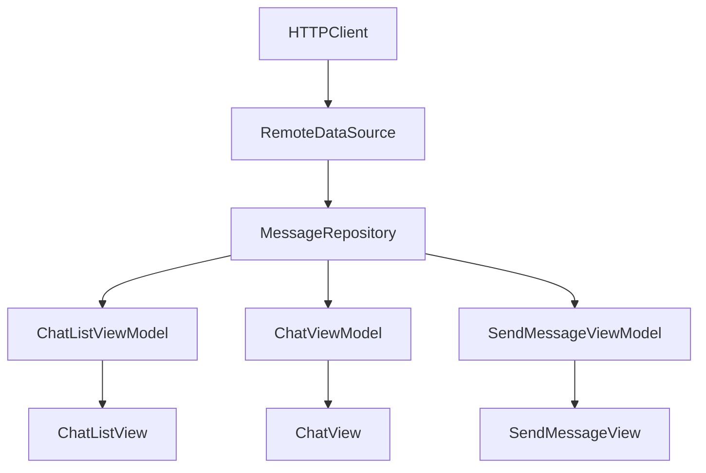
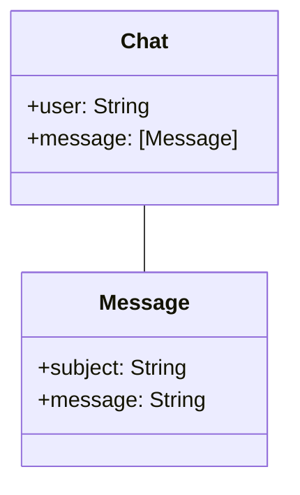
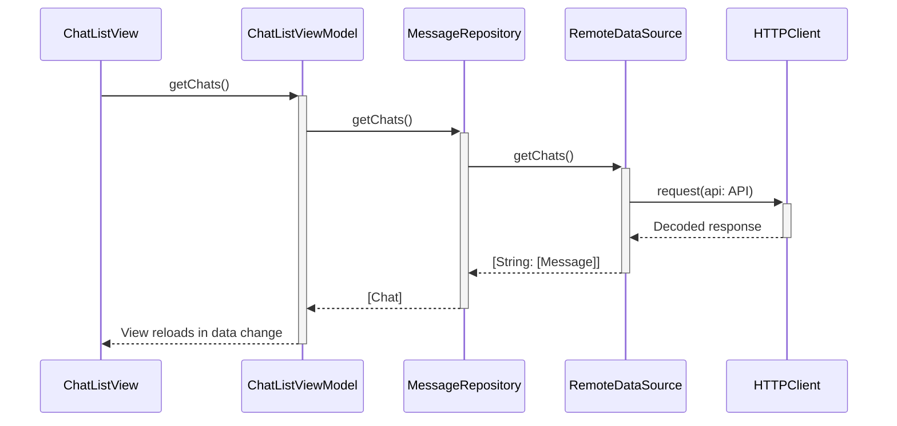
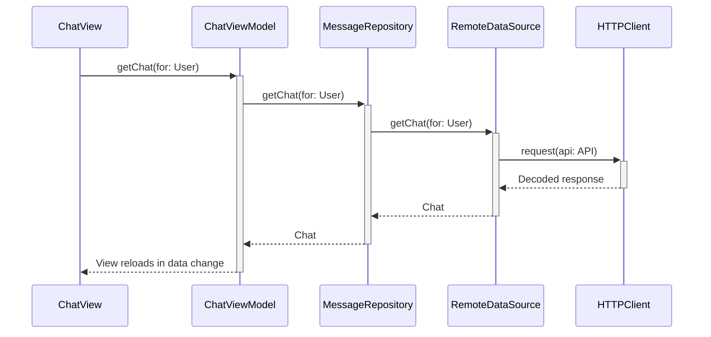
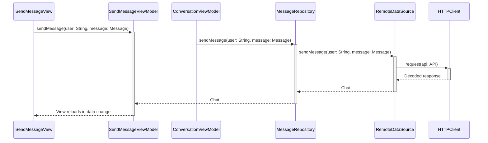

# Design

The architecture used is MVVM and Repository. This is a commonly used architecture nowadays 
because it separates responsibilities. 

- **HTTClient:** Responsible for making the HTTP requests.
- **RemoteDataSource:** Receives the HTTPClient as an injected object in the constructor.
    Focuses on getting the response from the client and handling any error.
- **MessageRepository:** Receives the RemoteDataSource as an injected object in the constructor.
    Focuses on converting the data into models used throughout the app and getting data from multiple
    data sources if necessary.
- **View Models:** Receives the repository as an injected object in the constructor.
    Transforms necessary data to be represented in the view and handles any functionality that comes 
    from the view, like creating a new message then the send message is tapped or fetching all the
    messages when the view loads.
- **Views:** Receives the view models as an injected object in the constructor.
    Displays the information transformed in the view model and handles user interaction with the application
    like taps, user input and other types of gestures.

### Class Diagram

### Get Messages Sequence Diagram

### Get Messages from User Sequence Diagram

### Send Message Squence Diagram

# Test Plan

The app already has some basic unit testing for the [RemoteDataSource](https://github.com/ignacioparadisi/lovevery-messages/blob/main/MSGTests/AWSDataSourceTests.swift) to take as an example and all the code was developed with dependency injection to make everything testable.

Steps:
   - Create json files for every response the http client can receive.
   - Create a mock URLSession using URLPotocol.

### Test plan for getting all messages

#### Test case 1:
Successfully fetch all messages from RemoteDataSource.

**Precondition:** json file with service response exists.

**Steps:**

   - Create a RemoteDataSource with an HTTPClient injecting the MockURLSession into the HTTPClient constructor
   - Setup the data that the mock URLSession will return
   - Trigger the getChats() function in the data source.
   - Capture and validate the output from getChats()

**Expected:** The data fetched from the mock URLSession correctly converts to the Decodable expected object.

#### **Test case 2:** 
Handle error fetching messages from RemoteDataSource.

**Precondition:** json file with service response exists.

**Steps:**
   - Create a RemoteDataSource with an HTTPClient injecting the MockURLSession into the HTTPClient constructor
   - Setup the error the mock URLSession will return
   - Trigger the getChats() function in the data source.
   - Capture and validate the output from getChats()

**Expected:** The URLSession should return the expected error.

#### Test case 3:
Successfully fetch all messages from MessagesRepository.

**Precondition:** json file with service response exists.

**Steps:**
   - Create a RemoteDataSource with an HTTPClient injecting the mock URLSession into the HTTPClient constructor
   - Create a MessageRepository injecting the RemoteDataSource created with the mock URLSession
   - Setup the data that the mock URLSession will return
   - Trigger the getChats() function in the repository.
   - Capture and validate the output from getChats()

**Expected:** The objects fetched from the repository must be of type [User] and the data should be the same as the json file.

#### Test case 4:
Handle error fetching messages from MessagesRepository.

**Precondition:** json file with service response exists.

**Steps:**
   - Create a RemoteDataSource with an HTTPClient injecting the mock URLSession into the HTTPClient constructor
   - Create a MessageRepository injecting the RemoteDataSource created with the mock URLSession
   - Setup the error the mock URLSession will return
   - Trigger the getChats() function in the repository.
   - Capture and validate the output from getChats()

**Expected:** The error thrown should be the handled expected error.

Unit tests, intergation tests and UI tests should be created when possible, ensure a high code percentage is covered. This plan previously mentioned is an example just for getting all messages in this case, but it should be implemented for every function in both, RemoteDataSource and MessageRepository as well as in all View Models.
UI Tests should also be implemented on the views to ensure that the views behave as expected and that every button and every field does what it needs to do.

# Test Automation

For automating the tests, a continuous integration tool like GitHub Actions or Jenkins can be used setting up automated triggers, for example when we create a merge request to merge our branch into develop or main.
